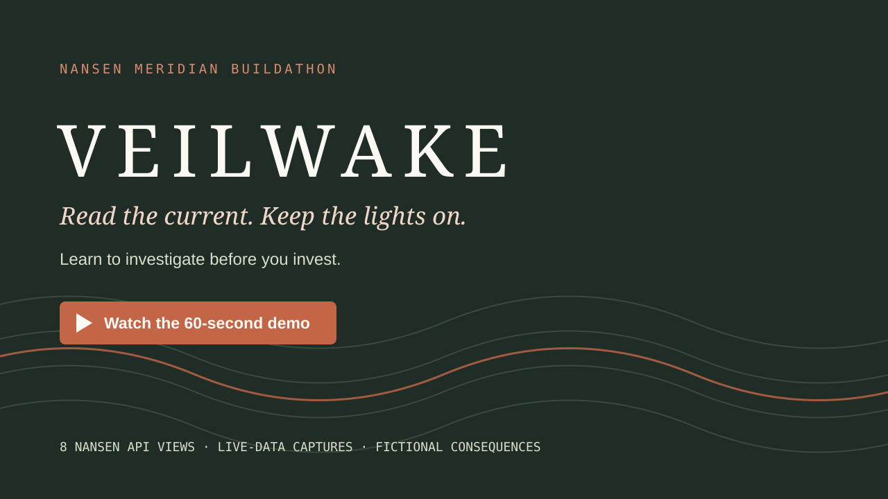

# VEILWAKE

**Read the current. Keep the lights on.**

A fog-of-war strategy game that turns Nansen's Token God Mode workflow into the water threatening a fragile settlement. Eight Nansen API views (screener, cohort flows, buyers, trades, transfers, Smart Money holdings, a wallet profile and Hyperliquid perp positioning) become the pressure you must read before you commit. No wallet connection, wagers, tokens to buy, or trading execution.

**Learn to investigate before you invest.** VEILWAKE is guided practice in a Nansen research workflow: it teaches *which questions to ask and which Nansen views answer them*, not which token to buy. 

## Table of contents

- [Setup](#setup)
- [Environment variables](#environment-variables)
- [Running locally](#running-locally)
- [Troubleshooting](#troubleshooting)
- [Demo video](#demo-video)
- [Player value & hackathon pitch](#player-value--hackathon-pitch)
- [How the game works](#how-the-game-works)
- [How Nansen data drives gameplay](#how-nansen-data-drives-gameplay)
- [Learn the platform](#learn-the-platform)
- [Architecture](#architecture)
- [Nansen endpoints used](#nansen-endpoints-used)
- [API usage](#api-usage)
- [Limitations](#limitations)
- [Documentation, license & hackathon links](#documentation-license--hackathon-links)

## Setup

Requirements: Node **22.13+** and npm. No extra service, database, login or cloud account is needed.

There are two ways to run it, and the difference matters:

- **No-key tutorial (rehearsal).** Just install and start the app. The three-chapter guided rehearsal runs entirely on authored, explicitly fictional data, needs no Nansen key and spends no credits. This is the fastest way to see the game.
- **Server-key live voyage.** For live Nansen data, copy `.env.example` to `.env` and set `NANSEN_API_KEY` to your own key. The key is read server-side only and never reaches the browser.

After the repository is published, clone it (or use **Code → Download ZIP**, extract it and open a terminal in the extracted folder):

```bash
git clone https://github.com/tko1229/veilwake.git
cd veilwake
```

Install dependencies, then start the no-key tutorial:

```bash
npm ci --include=dev
npm run dev
# Open http://127.0.0.1:4173 and choose "Start the tutorial".
```

`--include=dev` ensures TypeScript and Vite are installed even if your shell defaults to production-only dependencies; both are needed to build the application.

**Quick path:** install → start → tutorial. The live mode is optional and requires your own server-side Nansen key and available API credits.

Run these commands from the repository root after cloning it or extracting GitHub's source ZIP. For live mode, create your local `.env` only if it is missing (Windows PowerShell):

```powershell
if (-not (Test-Path .env)) { Copy-Item .env.example .env }
```

On macOS/Linux:

```bash
[ -f .env ] || cp .env.example .env
```

**Do not overwrite an existing `.env`.** Edit your key into it instead of re-copying. The no-key tutorial does not require this step.

For a local run, leave `ADMIN_TOKEN` blank (or remove that example line) if you want localhost Engine room access without a token. Never paste the key into browser code.

## Environment variables

| Variable | Default | Purpose |
|---|---|---|
| `NANSEN_API_KEY` | none | Live data, server only; the tutorial (rehearsal) works without it |
| `HOST` | `127.0.0.1` | Bind address; keep loopback for local use |
| `PORT` | `4173` | One HTTP port |
| `ADMIN_TOKEN` | none | Required for non-loopback binding; protects telemetry |
| `TRUSTED_ORIGIN` | none | Exact externally visible HTTPS origin behind a reverse proxy |
| `TRUST_PROXY` | off | Behind a reverse proxy: `true`, a hop count or an Express list (e.g. `loopback`). Makes rate limits and the per-player live cap (4 voyages) use the real client address, and turns off the token-free loopback telemetry bypass |
| `MAX_API_CALLS_PER_HOUR` | `600` | Hard application upstream-attempt budget |
| `MAX_API_CALLS_PER_DAY` | `4000` | Hard rolling daily budget |
| `CACHE_TTL_SECONDS` | `600` | Derived memory cache; capped at 600 seconds |

## Running locally

```bash
npm run dev
# Open http://127.0.0.1:4173
```

Production build:

```bash
npm run build
npm start
```

Mock tests and checks (consume **zero Nansen credits**):

```bash
npm test        # mocked upstream
npm run typecheck
npm run balance # offline rehearsal balance table, zero credits
```

> **⚠️ Paid commands.** The following hit the live Nansen API, spend real credits and require `NANSEN_API_KEY` in `.env`:

```bash
npm run smoke                 # wave 1 only: every toolkit view on one reach, resolve, Open-on-Nansen redirect (~30 credits)
npm run voyage                # full 3-wave live voyage through the HTTP API with a leak audit (~70 credits)
npm run voyage -- 3 keeper    # several voyages with a chosen doctrine
```

`live-voyage` plays like a careful player (scout first, then toolkit views while lenses last, brace the reaches with the worst opened evidence, arm one Smart Alert, make timeframe calls) and fails with a non-zero exit code if any response contains an EVM address, a USD amount or the API key, if a toolkit view comes back `unavailable`, or if an Open-on-Nansen redirect breaks.

`npm test` uses mocks and consumes **zero Nansen credits**. It exercises the engine, the Nansen client, the HTTP layer, the derivation rules (`tests/intel.test.ts`) and the tutorial coach (`tests/coach.test.ts`), including assertions that addresses and raw labels never appear in public game state. Browser QA is optional: `scripts/browser-qa.mjs` uses an installed browser automation binary supplied through `AGENT_BROWSER_BIN` and Chromium through `CHROME_PATH`; it intentionally exercises real live requests.

**Maintainer diagnostic (also paid):** `node scripts/probe.mjs` calls the live Token Screener and, if a candidate is returned, Flow Intelligence (normally up to two calls). It bypasses the game client's application budgets and prints diagnostic metadata; it is not part of setup, tests or release preparation. Do not publish its console output without reviewing it.

## Troubleshooting

- **`node` or `npm` is not recognized:** install [Node.js](https://nodejs.org/) 22.13+ with npm, reopen the terminal, and check `node --version` / `npm --version`.
- **PowerShell blocks `npm.ps1`:** use `npm.cmd ci` and `npm.cmd run dev`; there is no need to weaken your system-wide execution policy.
- **The page does not load:** keep the terminal running and open `http://127.0.0.1:4173`. If that port is busy, set `PORT=4174` in your local `.env` and use that port instead.
- **Live mode is unavailable:** configure `NANSEN_API_KEY` in the root `.env`, check available credits and restart the server. Never put the key in a `VITE_` variable. The tutorial still works without it.
- **`npm start` has no frontend:** run `npm run build` first, or use `npm run dev` for development.
- **A voyage disappears after a restart or long pause:** sessions are deliberately ephemeral; start a new run. Local tutorial progress is separate.

## Demo video

[](media/veilwake-buildathon-60s.mp4)

▶️ **[Watch/download the 60-second demo](media/veilwake-buildathon-60s.mp4)** · MP4 · 1920×1080 · approximately 46 MiB

## Player value & hackathon pitch

**Positioning:** a playable introduction to Nansen's research workflow. **Pitch line:** *learn to investigate before you invest.*

### The central argument

For someone new to on-chain analytics, having access to information is not the same as knowing what to do with it. Which panel should they open? Whose activity matters? What should they check when signals disagree? VEILWAKE gives those questions a purpose: players protect a settlement by investigating token-backed waterways, spending a limited research budget and choosing where to harvest, defend or divert pressure. Nansen's data changes the game, and the game explains the consequences of the player's research choices.

**The benefit is not learning which token to buy. It is practising which questions to ask, which Nansen views can answer them, and why one signal is not enough.**

Nansen gives users powerful on-chain intelligence — but a beginner still needs to know what to look for, and why it matters. VEILWAKE turns that learning curve into a strategy game. You protect a settlement across three waves. Each waterway is backed by a token, and eight Nansen API views shape the conditions you face. With limited research lenses you investigate who is moving funds, whether heavy buying hides churn, and whether a large buyer has a track record. Then you choose where to harvest, defend or divert. After every wave, a pressure ledger shows what affected the outcome — including evidence you never opened. Mistakes cost fictional hull, not real capital. A guided rehearsal introduces the workflow. Live runs let players practise it with real Nansen observations. Then token links and copyable research prompts help them continue on Nansen.
We are not teaching price prediction. We are teaching the questions that make Nansen useful.

### What players gain

1. **A place to practise without trading capital.** No wallet, signing, wager or token purchase. The clearly labelled tutorial needs no API key and moves from a guided investigation to confirming an opportunity with limited evidence — so a newcomer can make mistakes before risking real money. It lowers the barrier to trying the workflow; it does not remove the risk of later investing.
2. **A map from questions to Nansen tools.** A repeatable sequence — **market context → cohort flows → buyers → trades → transfers → longer-term holdings → wallet profile** — where every panel names its Nansen feature, question and window. Profiler unlocks after Who Bought/Sold, mirroring "find the wallet, then profile it". A useful starter workflow, not the only valid order.
3. **Why "who" matters as much as "how much".** The signature lesson is the **false calm**: visible whale inflows can coexist with Smart Trader outflows. Players get a reason to use Nansen's labelled cohorts instead of treating all volume as one signal.
4. **Checking evidence rather than trusting a headline.** Heavy buying can hide heavy selling by the same buyers; a big buyer may have little history; a short-term view can conflict with a longer trend.
5. **Learning what to research next.** Lenses are limited, so players must decide which further observation is most useful before committing — modelling limited attention and research time.
6. **Feedback that explains a mistake.** The pressure ledger labels each factor **seen** or **not opened**, turning a bad call into a specific next step rather than a blank loss.
7. **A concrete next step on Nansen.** The Field Manual gives "how to do it on Nansen" steps, and the logbook links each live token to its real Token God Mode page with a copyable research prompt.

### What the game teaches

| Lesson practised | How the game teaches it | Application on Nansen |
|---|---|---|
| Market context is a starting point, not a conclusion | Free price, volume and liquidity context precedes deeper investigation | Use Token Screener to find candidates, then investigate beyond headline activity |
| Participant identity matters | Whale inflows can disagree with trading-cohort outflows | Compare labelled cohorts in Flow Intelligence |
| Activity is not automatically conviction | Buyers & Sellers compares buying, selling and concentration in a bounded sample | Investigate churn and concentration before reading high buying volume |
| Recent transactions can challenge an aggregate | DEX Trades exposes recent buy/sell balance | Inspect the trade sample behind an initial impression |
| A transfer is not necessarily a trade | Transfers distinguishes exchange, team and contract-related movements | Use labels and context; an exchange deposit alone does not prove a sale |
| Timeframes can tell different stories | Daily/hourly flows, a short resolution window and a seven-day holdings trend | Compare a short window with a longer baseline instead of assuming one settles it |
| A large buyer deserves scrutiny | Buyers & Sellers leads to a 30-day Profiler summary | Check observable wallet performance and the limits of its coverage |
| Derivatives add another layer of context | Smart Money perp positioning becomes weather and token-specific modifiers | Treat Perp Screener as extra context, not a standalone spot forecast |
| Monitoring should have a purpose | A modelled Smart Alert watches a chosen condition | Decide what change would justify revisiting an investigation; configure real alerts separately on Nansen |
| Uncertainty is not safety | Missing data stays unknown; a timeframe call can be passed | Recognise coverage gaps and avoid forcing a conclusion |

### The practical handoff to Nansen

**Guided rehearsal → live-data practice → explanation of consequences → continued research on Nansen.** By the end, the intended change is from *"There are many dashboards here. What should I look at?"* to *"I want to compare whale and Smart Trader flows, inspect the recent buyers and trades, check the weekly holdings trend, and profile a relevant buyer before drawing a conclusion."* That is the onboarding value: the player has practised both the vocabulary and the purpose of the tools. 

## How the game works

1. **Survey (free):** every reach opens a **Token God Mode panel**. The overview is visible: Token Screener price, 24h change, 0–3 volume/liquidity/market-cap bands and buy/sell bias, plus whale/exchange direction, the wave's *Storm glass* (perp weather) and the reach's *perp shadow*. Everything else is removed server-side.
2. **Investigate (1 lens per view):** Flow Intelligence (the scout: six cohorts, 1h context + 1d baseline) and five toolkit views: Who Bought/Sold, DEX Trades, Token Transfers, Flows (Smart Money) and Profiler. Profiler requires Who Bought/Sold first. On Nansen, too, you find the wallet in the ledger before you profile it.
3. **Commit:** one stance per reach. Harvest is free, brace costs 1 supply and divert costs 2. Optionally arm one **Smart Alert** (tripwire) per wave and, on scouted reaches, make a **timeframe call**.
4. **Consequence:** the server reads the 5-minute Flow Intelligence window, adds every modifier, applies neighboring diversions, damage and charge. The wave report's **pressure ledger** lists each source, its value and whether you opened it (`seen`) or not (`not opened`).
5. **Adapt:** surviving waves replenish 3 supply and 2 lenses (caps 12 and 10) and bring three new token-backed reaches.

Harvest captures 1–6 charge but takes full pressure. Brace captures 1 charge and takes 28% of pressure, rounded up. Divert captures none, pushes 55% of its pressure into the next reach, and still takes half of any pressure diverted into it. A Smart Alert (*Smart traders exit*, *Whales exit* or *Exchange inflow spike*) that fires on the 5m read turns a harvesting gate into a free brace. A call predicts whether Smart Traders **hold** or **turn** their 1h direction in the 5m read: +12 points right, −4 wrong, 0 for **pass**. It is scored against the real response, never a price.

Doctrines: **Keeper** 100 hull / 6 supply / 5 lenses; **Cartographer** 85 / 6 / 8; **Engineer** 100 / 9 / 3. Progression consists of escalating run consequences, new waves, local records, practiced skills and outcome achievements. There is no token economy or artificial grind.

## How Nansen data drives gameplay

| Nansen view | In-game instrument | Game transformation |
|---|---|---|
| Token Screener (24h) | Harbor chart | Nine distinct non-stablecoin reaches per run; liquidity band 0 → +2, band 1 → +1 pressure |
| Flow Intelligence 1d / 1h | Current lens (scout) | Six cohort directions + 0–3 strength; whale/exchange visible, the rest fogged |
| Flow Intelligence 5m | Resolution read | Base hazard from trader/whale outflow, exchange inflow and missing cohorts |
| Trader out + whale/fresh-wallet in | **The false calm** | +6 hidden crosscurrent |
| Trading cohort flips 1h → 5m | Turning current | +4; Smart Trader direction also scores the call |
| Who Bought/Sold (BUY, 24h, top 25) | Dock ledger | Top buyers kept <20% +2 (churn), ≥60% −1; one buyer >50% +1; Smart Money net buyers −2 |
| DEX Trades (1h, 100 newest) | Tide log | Sells ≥60% of value +2; buys ≥60% −1; thin tape (<5 trades) +1 |
| Token Transfers (24h, 25 largest) | Cargo manifest | Net ≥2 into exchange-labeled wallets +2; net ≥2 out −1; ≥2 deployer/team sends +1 |
| Flows · Smart Money (7d hourly) | Depth sounding | Holdings ≤−5% +2 (distributing); ≥+5% −1 (accumulating) |
| Weekly trend × live trader exit | Long ebb / Squall in a flood | +1 / −1 combination |
| Profiler PnL summary (30d, largest net buyer) | Captain's log | No record +1; struggling +1; seasoned −1 |
| Perp Screener (Smart Money, 24h, top 60) | Storm glass + perp shadow | Weather −1..+2 on every reach; ±1 on a reach whose token has a Hyperliquid perp (e.g. WETH → ETH) |
| Missing cohort / failed view | `?` / "unavailable" clue | Cohorts: uncertainty cost. Views: 0 pressure. Never faked |
| Player diverts one gate | none (player action) | Added pressure in the neighboring reach |

**Hazard = clamp(base cohort hazard + modifiers, 2, 40)**, then neighbor diversion. Each toolkit view is individually bounded. Full formulas: [mechanics](docs/MECHANICS.md).

Raw Nansen labels are mapped server-side to coarse archetypes (smart money, whale-class, exchange, deployer/team, pools & bots, high-activity, unlabeled, other) and then discarded. Wallet addresses, raw labels, transaction hashes, raw wallet/flow USD amounts and token contract addresses are excluded from public game JSON. Market token prices are visible in the overview. The intentional address exception is a player-clicked **Open on Nansen** redirect: its destination URL contains that token's public contract address, never a wallet address. See [the processing boundary](docs/COMPLIANCE.md#processing-boundary). Cohorts may overlap, so their flows are never summed as disjoint capital.

**Time honesty:** 1d baseline, 1h context and 5m resolution are overlapping past windows. The toolkit uses its own past windows (1h, 24h, 7d, 30d). None of this is a backtest or future-price reveal. A fresh HTTP response can contain upstream-cached observations. Endpoint, window, fetch time and Nansen request ID stay visible in Source proof.

## Learn the platform

- **Tutorial.** *Start the tutorial* on the title screen opens a three-chapter guided rehearsal. A coach highlights the next control and reacts to what you actually open, from the analyst workflow on a false calm to finding the open current yourself.
- **Token God Mode panel.** Each reach is laid out the way Nansen lays out a token. Every view names where it lives in the app (e.g. *Token God Mode → Buyers & Sellers*), the question it answers and its window.
- **Field Manual.** Lists every Nansen feature as a *live mechanic* (the 8 API-backed views), *modelled* (Smart Money, Labels, Smart Alerts, timeframe comparison, Watchlists, Nansen AI) or *lesson only*, with the reason: Holders, Indicators, PnL Leaderboards, Portfolio, Points, Trading, Prediction Markets, Chains. Each entry has "how to do it on Nansen" steps and an `app.nansen.ai` link. Twelve practiced skills are tracked in localStorage (skill names only).
- **Research logbook.** The end screen lists every token you sailed with the verdicts you saw. Each has an **Open on Nansen** link to that token's real Token God Mode page and a copyable **Nansen AI research prompt** built from your observations.
- **Achievements** reward the workflow, e.g. *The full workflow*, *Checked the captain*, *The tripwire held*, *Reads the timeframes*.

## Architecture

```text
React browser -> same-origin Express game routes -> server-only Nansen client (8 endpoints)
                         |                               |
                 authoritative game state      derive: bands, archetypes, bounded clues
                         |                               |
                 decisions / consequences <---- display-safe readings + clues
```

One Node process. No database, login service, wallet SDK, AI model or external font/CDN. React 19 + TypeScript + Vite 6 + Express 5. Server-owned sessions (10-minute idle, 20-minute absolute lifetime), typed pure engine (`shared/engine.ts`) and derivation layer (`shared/intel.ts`). Production serves the compiled frontend and backend on one port.

Game API: `POST /api/game` `{mode, doctrine}` · `GET /api/game/:id` · `POST /api/game/:id/scout` `{laneId, revision}` · `POST /api/game/:id/investigate` `{laneId, tool, revision}` · `POST /api/game/:id/resolve` `{plans, revision, alert?, calls?}` · `POST /api/game/:id/next` `{revision}` · `GET /api/game/:id/nansen/:wave/:laneId` (302 to Nansen). There is no forecast route.

## Nansen endpoints used

All eight are official REST **POST** endpoints at `https://api.nansen.ai/api/v1`, called with the server-side `apikey` header. Each is published at **1 credit** per call.

| Endpoint | Request | Response fields consumed |
|---|---|---|
| `/token-screener` | chains `ethereum/base/solana`, timeframe `24h`, page 1 × 18, stablecoins excluded, volume desc | `chain, token_address, token_symbol, price_usd, price_change, volume, liquidity, market_cap_usd, buy_volume, sell_volume, netflow` |
| `/tgm/flow-intelligence` | chain + token address + `1d`, `1h` or `5m` | `data[0].<cohort>_net_flow_usd` for six cohorts |
| `/tgm/who-bought-sold` | `buy_or_sell: BUY`, last 24h, 25 rows, `bought_volume_usd` desc | `address` (server-only), `address_label`, `bought_volume_usd, sold_volume_usd` |
| `/tgm/dex-trades` | last 1h, 100 rows, `block_timestamp` desc | `action, estimated_value_usd, trader_address_label` |
| `/tgm/transfers` | last 24h, 25 rows, `transfer_value_usd` desc | `from_address_label, to_address_label` |
| `/tgm/flows` | `label: smart_money`, last 7d, up to 200 hourly rows, date asc | `date, token_amount, holders_count` |
| `/profiler/address/pnl-summary` | largest qualifying net buyer from the ledger, chain, last 30d | object: `traded_times, traded_token_count, realized_pnl_usd, win_rate` |
| `/perp-screener` | last 24h, `trader_type: sm`, 60 rows, `smart_money_volume` desc | `token_symbol, current_smart_money_position_longs_usd/_shorts_usd, net_position_change, smart_money_volume, funding` |

Pagination is explicit and bounded; no endpoint is paged beyond page 1. Profiler is skipped (and shown as "Nobody to profile" or "unavailable") if the ledger has no qualifying net buyer or failed. The [redistribution guide](https://docs.nansen.ai/guides/redistribution-guide) writes two of these paths in shorthand, `tgm/token-screener` and `tgm/perp-screener`. The real contracts are `/api/v1/token-screener` and `/api/v1/perp-screener`.

## API usage

A fresh, fully uncached live voyage makes up to **74 calls**:

```text
1 token screener + 1 perp screener
+ per wave: 6 flow-intelligence (1h + 1d × 3 tokens)
          + 12 toolkit (buyers, trades, transfers, flows × 3)
          + up to 3 profiler
          + 3 flow-intelligence 5m at resolution
= 2 + 3 × 24 = 74
```

## Limitations

- Single-player, single-process; no global leaderboard or persistent live-world archive.
- Nansen observations can be sparse or cached, and not every cohort or view exists for every token. Fresh-wallet fields exist only on the daily baseline; missing values are never fabricated.
- Label → archetype mapping is a keyword heuristic over free-text labels and can misclassify. Perp-shadow matching is symbol-based (e.g. WETH → ETH, cbBTC → BTC).
- Profiler reads only the single largest net buyer and only on chains the endpoint supports.
- A live voyage requires nine distinct candidates from the bounded screener page; insufficient coverage produces an explicit error.
- Pressure rules are game design over rolling windows, not historical ground truth or investment-risk measurement.
- "Open on Nansen" links resolve only while the voyage is alive on the server.
- Doctrine balance and learning outcomes have not been validated in a large player study.

## Documentation, license & hackathon links

- **Docs:** [game mechanics](docs/MECHANICS.md) · [design](docs/DESIGN.md) · [compliance](docs/COMPLIANCE.md)
- **Hackathon:** [Nansen Meridian Buildathon](https://nansen.ai/campaigns/meridian-buildathon) · [official help article](https://release.nansen.ai/help/articles/3540155-nansen-meridian-buildathon-sep-14-27) · [entry form](https://nansen-ai.typeform.com/meridian-submit)
- **License:** [MIT](LICENSE) © 2026 VEILWAKE contributors.
- **Creator:** a solo project by [tko1229](https://github.com/tko1229).
